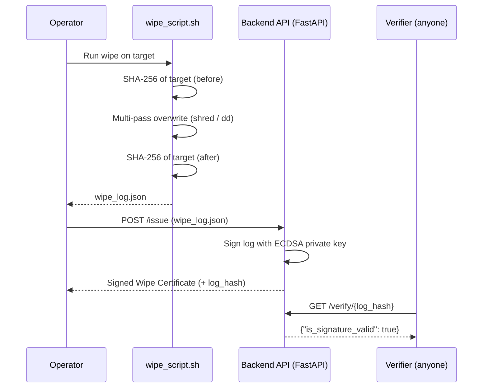

# 🛡️ Project Oblivion: Certified Data Sanitization


> Securely wipe storage, then **prove it**: every wipe produces a cryptographically signed, publicly verifiable certificate.

**Project Oblivion** is a data sanitization and verification toolkit. It overwrites data on a target device or file, records forensic evidence of the operation, and issues a tamper-evident **Wipe Certificate** signed with ECDSA. Built for the **Smart India Hackathon (SIH) 2025**.

---

## 📑 Table of Contents

- [The Problem](#-the-problem-data-remanence)
- [How It Works](#-how-it-works)
- [Features](#-features)
- [Tech Stack](#-tech-stack)
- [Repository Structure](#-repository-structure)
- [Quick Start](#-quick-start)
- [Demo: Certified Wipe](#-demo-certified-wipe)
- [API Reference](#-api-reference)
- [Security Model & Limitations](#-security-model--limitations)
- [Best Practices](#-best-practices)
- [Roadmap](#-roadmap)
- [Contributing](#-contributing)
- [License](#-license)

---

## ❗ The Problem: Data Remanence

Deleting a file only removes its pointer in the file system. The underlying bytes usually remain on disk and can be recovered with forensic tools. This is a real risk when devices are resold, recycled, or decommissioned, and organizations have no easy way to *prove* to auditors that data was destroyed.

Oblivion tackles both halves: **secure overwriting** and a **verifiable audit trail**.

---

## ⚙️ How It Works



1. **Secure Wipe**: `wipe_script.sh` performs a multi-pass overwrite of the target device or file.
2. **Forensic Evidence**: SHA-256 hashes are computed before and after the wipe and recorded in the log.
3. **Certificate Issuance**: The log (device details, timestamps, hashes) is sent to the backend.
4. **Digital Signature**: The backend signs the log with an ECDSA private key, producing a JSON Wipe Certificate.
5. **Verification**: A public endpoint lets anyone confirm a certificate's signature is authentic and unaltered.

---

## ✨ Features

| Feature | Description |
|---|---|
| Multi-pass secure wipe | Overwrites data using `shred` and `dd` |
| Before/after hashing | SHA-256 evidence captured in the wipe log |
| Signed certificates | ECDSA signatures make tampering detectable |
| Public verification | Anyone can validate a certificate without special access |
| One-command backend | Dockerized service via Docker Compose |
| Document tooling | PDF certificates (FPDF2) and QR codes for quick verification |

---

## 🧰 Tech Stack

| Layer | Technology |
|---|---|
| Backend | Python, FastAPI |
| Cryptography | Python `cryptography` library (ECDSA) |
| Scripting | Bash (`shred`, `dd`, `sha256sum`) |
| Containerization | Docker, Docker Compose |
| Documents | FPDF2 (PDF), QR Code |

---

## 📁 Repository Structure

```text
oblivion-sih2025/
├── tools/
│   ├── pdf/                 # PDF certificate generation
│   ├── qr/                  # QR code generation
│   └── signing/             # Key / signing utilities
├── oblivion/
│   ├── backend/
│   │   ├── app/
│   │   │   └── main.py      # FastAPI application
│   │   ├── Dockerfile
│   │   └── requirements.txt
│   ├── docs/                # Project documentation
│   ├── frontend/
│   │   └── oblivion-ui/     # Web UI
│   └── scripts/
│       └── wipe_script.sh   # Wipe + logging script
└── docker-compose.yml
```

---

## 🚀 Quick Start

### Prerequisites

- [Docker](https://docs.docker.com/get-docker/) and Docker Compose
- `curl` or Postman (or any API client)
- A Linux/macOS shell with `bash`, `shred`, `dd`, and `sha256sum` for running the wipe script

### Run the backend

```bash
git clone https://github.com/thatguygarv/oblivion-sih2025.git
cd oblivion-sih2025
docker-compose up --build
```

The API is now available at **http://localhost:8004**.

> 💡 FastAPI serves interactive docs at `http://localhost:8004/docs` by default (unless disabled in `main.py`).

---

## 🎬 Demo: Certified Wipe

> ⚠️ **Practice on a test file or loop device, never a disk you care about.** Wiping the wrong target causes irreversible data loss.

### Step A: Run the wipe script

The script writes a `wipe_log.json` to its directory.

```bash
chmod +x ./oblivion/scripts/wipe_script.sh
./oblivion/scripts/wipe_script.sh
```

### Step B: Issue a certificate

```bash
curl -X POST "http://localhost:8004/issue" \
  -H "Content-Type: application/json" \
  -d @wipe_log.json
```

The response contains the signed certificate and a `log_hash`.

### Step C: Verify the certificate

```bash
# Replace <log_hash> with the value returned by /issue
curl http://localhost:8004/verify/<log_hash>
```

Expected result:

```json
{"is_signature_valid": true}
```

---

## 📡 API Reference

| Method | Endpoint | Description |
|---|---|---|
| `POST` | `/issue` | Accepts a wipe log (JSON), signs it, and returns a Wipe Certificate including `log_hash` |
| `GET` | `/verify/{log_hash}` | Verifies the ECDSA signature for the certificate identified by `log_hash` |

<details>
<summary><strong>Illustrative certificate shape</strong> (field names are examples; see <code>main.py</code> for the exact schema)</summary>

```json
{
  "log": {
    "device": "<target device or file>",
    "started_at": "<ISO 8601 timestamp>",
    "completed_at": "<ISO 8601 timestamp>",
    "hash_before": "<sha256>",
    "hash_after": "<sha256>"
  },
  "log_hash": "<sha256 of the log>",
  "signature": "<base64 ECDSA signature>"
}
```

</details>

---

## 🔐 Security Model & Limitations

**What the certificate proves:** the wipe log was issued by the holder of the signing key and has not been modified since.

**What it does not prove on its own:**

- A changed before/after hash shows the data *changed*; it is evidence of an overwrite, not a guarantee that no residual data survives.
- On **SSDs, NVMe drives, and flash media**, wear-leveling and over-provisioning can leave copies of data in areas software overwrites cannot reach. For these, prefer the drive's built-in secure erase / crypto-erase (e.g., ATA Secure Erase, NVMe Sanitize) where available.
- The signature attests to the log's integrity, not to the operator's honesty. The wipe log is generated on the machine being wiped, so trust in that environment matters.

---

## ✅ Best Practices

- Double-check the target device before every run; add confirmation prompts to any UI or wrapper.
- Store production ECDSA private keys in an **HSM or secure enclave**.
- Keep logs and private keys access-controlled and **encrypted at rest**.
- Never commit private keys to the repository; load them via environment variables or a secrets manager.
- Serve the API over **HTTPS** outside of local demos.

---

## 🗺️ Roadmap

- [ ] Support for hardware secure-erase commands (ATA / NVMe)
- [ ] Post-wipe verification sampling (read back and confirm overwrite pattern)
- [ ] Certificate PDF with embedded QR code linking to `/verify`
- [ ] Key rotation and public-key publishing endpoint
- [ ] Web UI with explicit confirmation flow for destructive actions
- [ ] Automated tests and CI pipeline

*(Edit this list to match what your team actually plans.)*

---

## 🤝 Contributing

Contributions are welcome.

1. Fork the repository
2. Create a branch: `git checkout -b feature/your-feature`
3. Commit your changes and push the branch
4. Open a Pull Request describing what and why


